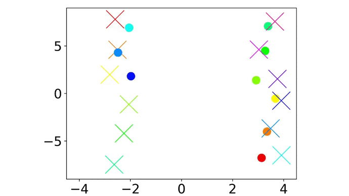

# LEMURS: LEarning distributed MUlti-Robot interactionS

This repository provides the code for our paper "LEMURS: Learning Distributed Multi-robot Interactions". Please check out our project website for more details: https://eduardosebastianrodriguez.github.io/LEMURS/.

## Dependencies

Our code is tested with Ubuntu 20.04 and Python 3.8. It depends on the following Python packages: 

```torchdiffeq 0.2.3```

```torch 1.12.1``` 

```numpy 1.17.4```

```matplotlib 3.5.2```

## Demo with fixed swapping problem
Run ```python ./FixedSwapping/Demo.py``` to check the learned control policy for the fixed swapping problem. It uses the pretrained model stored in ``` ./FixedSwapping/FS4_42_learn_system_LEMURS.pth ```

<p float="left">

 
</p>

To generate the training and evaluation datasets, run ```python ./FixedSwapping/DatasetGenerator.py```, choosing the following arguments as you prefer:

```--numTrain ```: number of training trajectories. It is 20000 by default.

```--numTests```: number of testing trajectories. It is 20000 by default.

```--numSamples```: number of samples per trajectory. It is 5 by default.

```--seed```: set random seed. It is 42 by default.

```--numAgents```: number of robots used as ground-truth. It is 4 by default.

To train you own model, run ```python ./FixedSwapping/TrainingLEMURS.py```, choosing the following arguments as you prefer:

```--numTrain ```: number of training trajectories in the dataset. It is 20000 by default.

```--numTests```: number of testing trajectories in the dataset. It is 20000 by default.

```--numSamples```: number of samples per trajectory in the dataset. It is 5 by default.

```--seed_data```: random seed used to generate the dataset. It is 42 by default.

```--seed_train```: set random seed for the training. It is 42 by default.

```--numAgents```: number of robots used in the dataset. It is 4 by default.

To train the MLP, GNN and GNNSA models, run ```python ./FixedSwapping/TrainingMLP.py```, ```python ./FixedSwapping/TrainingGNN.py``` and ```python ./FixedSwapping/TrainingGNNSA.py``` respectively, using the same arguments detailed above.

The files ```python ./FixedSwapping/Evaluation.py```, ```python ./FixedSwapping/Training.py```, ```python ./FixedSwapping/Scalability.py``` evaluate LEMURS, compare the different models and check the scalability of LEMURS respectively.
Regarding ```python ./FixedSwapping/Evaluation.py```, choose the arguments according to the ones used for generating the datasets and training the models.

## Demo with time-varying swapping problem
Run ```python ./TimeVaryingSwapping/Demo.py``` to check the learned control policy for the time-varying swapping problem. It uses the pretrained model stored in ``` ./TimeVaryingSwapping/FS4_42_learn_system_LEMURS.pth ```

<p float="left">

 
</p>

To generate the training and evaluation datasets, run ```python ./TimeVaryingSwapping/DatasetGenerator.py```, choosing the following arguments as you prefer:

```--numTrain ```: number of training trajectories. It is 20000 by default.

```--numTests```: number of testing trajectories. It is 20000 by default.

```--numSamples```: number of samples per trajectory. It is 5 by default.

```--seed```: set random seed. It is 42 by default.

```--numAgents```: number of robots used as ground-truth. It is 4 by default.

To train you own model, run ```python ./TimeVaryingSwapping/TrainingLEMURS.py```, choosing the following arguments as you prefer:

```--numTrain ```: number of training trajectories in the dataset. It is 20000 by default.

```--numTests```: number of testing trajectories in the dataset. It is 20000 by default.

```--numSamples```: number of samples per trajectory in the dataset. It is 5 by default.

```--seed_data```: random seed used to generate the dataset. It is 42 by default.

```--seed_train```: set random seed for the training. It is 42 by default.

```--numAgents```: number of robots used in the dataset. It is 4 by default.

To train the MLP, GNN and GNNSA models, run ```python ./TimeVaryingSwapping/TrainingMLP.py```, ```python ./TimeVaryingSwapping/TrainingGNN.py``` and ```python ./TimeVaryingSwapping/TrainingGNNSA.py``` respectively, using the same arguments detailed above.

The files ```python ./TimeVaryingSwapping/Evaluation.py```, ```python ./TimeVaryingSwapping/Training.py```, ```python ./TimeVaryingSwapping/Scalability.py``` evaluate LEMURS, compare the different models and check the scalability of LEMURS respectively.
Regarding ```python ./TimeVaryingSwapping/Evaluation.py```, choose the arguments according to the ones used for generating the datasets and training the models.

## Demo with flocking problem
Run ```python ./Flocking/Demo.py``` to check the learned control policy for the flocking problem. It uses the pretrained model stored in ``` ./Flocking/FS4_42_learn_system_LEMURS.pth ```

<p float="left">

 
</p>

To generate the training and evaluation datasets, run ```python ./Flocking/DatasetGenerator.py```, choosing the following arguments as you prefer:

```--numTrain ```: number of training trajectories. It is 20000 by default.

```--numTests```: number of testing trajectories. It is 20000 by default.

```--numSamples```: number of samples per trajectory. It is 5 by default.

```--seed```: set random seed. It is 42 by default.

```--numAgents```: number of robots used as ground-truth. It is 4 by default.

To train you own model, run ```python ./Flocking/TrainingLEMURS.py```, choosing the following arguments as you prefer:

```--numTrain ```: number of training trajectories in the dataset. It is 20000 by default.

```--numTests```: number of testing trajectories in the dataset. It is 20000 by default.

```--numSamples```: number of samples per trajectory in the dataset. It is 5 by default.

```--seed_data```: random seed used to generate the dataset. It is 42 by default.

```--seed_train```: set random seed for the training. It is 42 by default.

```--numAgents```: number of robots used in the dataset. It is 4 by default.

To train the MLP, GNN and GNNSA models, run ```python ./Flocking/TrainingMLP.py```, ```python ./Flocking/TrainingGNN.py``` and ```python ./Flocking/TrainingGNNSA.py``` respectively, using the same arguments detailed above.

The files ```python ./Flocking/Evaluation.py```, ```python ./Flocking/Training.py```, ```python ./Flocking/Scalability.py``` evaluate LEMURS, compare the different models and check the scalability of LEMURS respectively.
Regarding ```python ./Flocking/Evaluation.py```, choose the arguments according to the ones used for generating the datasets and training the models.


## Citation
If you find our papers/code useful for your research, please cite our work as follows.

E. Sebastian, T. Duong, N. Atanasov, E. Montijano, C. Sagues. [LEMURS: Learning Distributed Multi-robot Interactions](https://eduardosebastianrodriguez.github.io/LEMURS/). IEEE ICRA 2023

 ```bibtex
@article{sebastian22LEMURS,
author = {Eduardo Sebasti\'{a}n AND Thai Duong AND Nikolay Atanasov AND Eduardo Montijano AND Carlos Sag\"{u}\'{e}s},
title = {{LEMURS: Learning Distributed Multi-robot Interactions}},
journal = {IEEE International Conference on Robotics and Automation},
year = {2023}
}
```